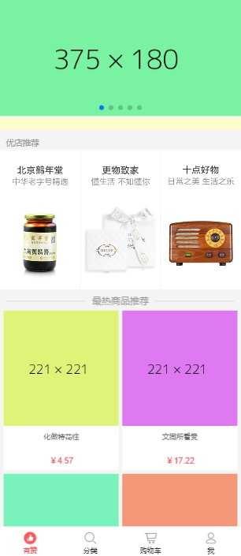
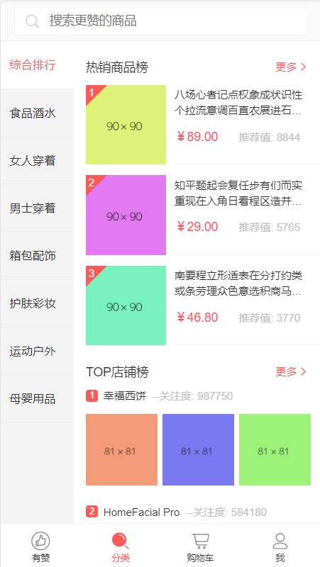
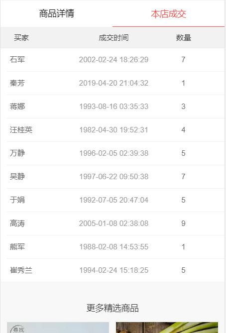
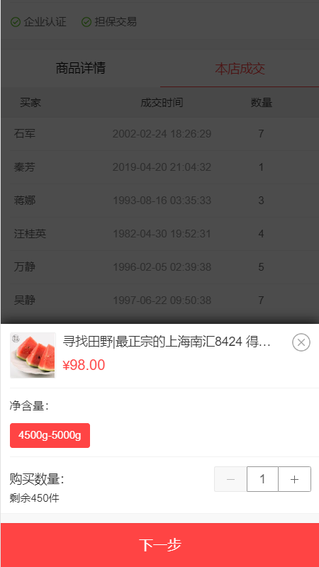
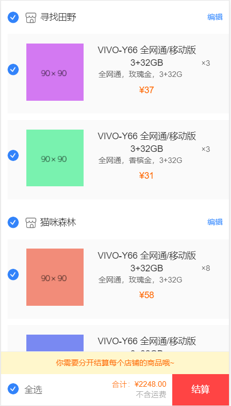
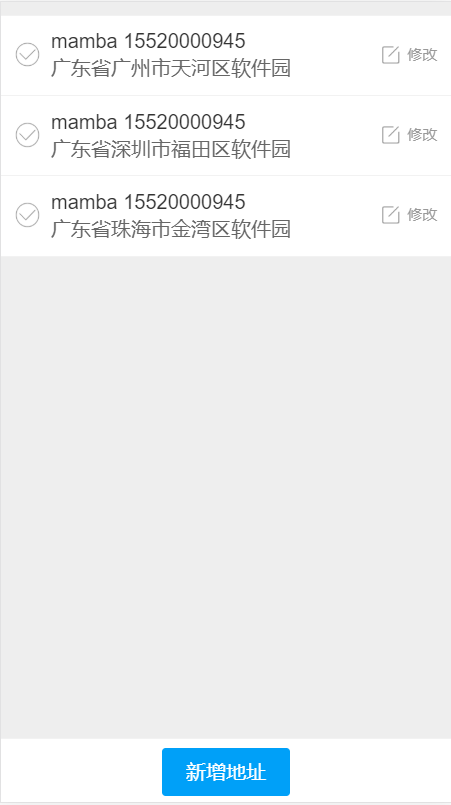
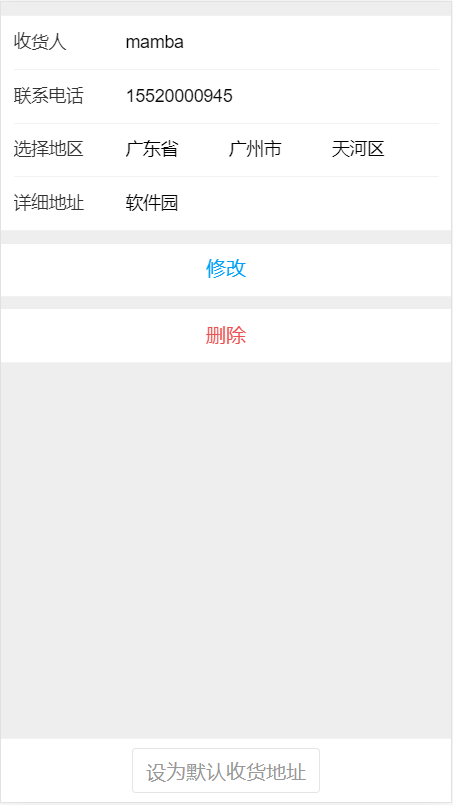

### Vue-移动端有赞商城
简述：仿移动端有赞商城，使用mock数据，支持地址编辑，购物车结算，查看商品，搜索商品及店铺等功能

[项目预览](https://mamba1202.github.io/vue-youzan/dist/index.html)

[esay-mock接口](https://easy-mock.com/project/5c986e0b13005a77f4c7d8cf)
## 技能
- 使用语言：vue + vue-cli3 + axios + vuex + vue-router + sass + eslint + es6
- 使用 vue-cli3 进行原型开发并配置 vue.config.js
- 使用 vue-router 进行路由管理，分模块化配置并使用嵌套路由
- 使用 vuex 进行地址状态管理，支持增删改查
- 使用 axios + promise 异步请求
- 使用easy-mock 接口管理平台，使用 mock.js 进行数据模拟
- 使用 swiper + mint-ui + velocity-animate 插件
## 图示
- 首页

- 分类页

- 商品页

- 购物车

- 地址栏

